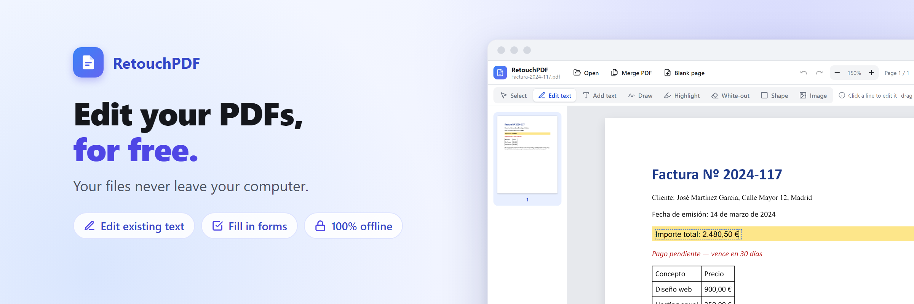

<p align="center"></p>

# RetouchPDF

*Edit your PDFs without them ever leaving your computer.*

**Free, private PDF editor that runs entirely in your browser.** Edit the text already in a PDF, fill in forms, tick checkboxes, sign, highlight, add images, and rearrange or merge pages. Your files never leave your computer.

**[Use it online](https://gabdez.github.io/retouchpdf)** · **[Support the project](https://ko-fi.com/gabdez)**

## Privacy

Everything happens in your browser. The page carries a Content-Security-Policy that makes the browser block every network request it could make: no uploads, no analytics, no cookies, no external scripts. You can check it yourself: open the developer tools (F12), go to the Network tab and edit a document. Nothing is sent.

You can also download the page (link at the bottom of the home screen) and open the file from your computer, with no internet connection at all.

### Offline copy

The link at the bottom of the home screen saves the editor as a single file, `retouchpdf.html`. Open it in Edge or Chrome: it works with no internet connection.

- **Download it only from the official site.** The licence allows modified copies; the official file's SHA-256 fingerprint is published at [SHA256SUMS.txt](https://gabdez.github.io/retouchpdf/SHA256SUMS.txt). On Windows, check yours with `Get-FileHash .\retouchpdf.html` in PowerShell.
- **A downloaded copy never updates itself or contacts the internet.** Its version and date are shown at the bottom of the home screen, next to a "Check for updates" link that opens the official site.
- Some browsers or antivirus programs warn when downloading an `.html` file; this is expected for this kind of file.

## Features

- **Edit existing text.** Choose **Edit text**, click a line (or drag across several lines to edit a paragraph), type, press Enter. The original text is removed from the PDF itself, and the new text takes its place with the same size, color and angle.
- **Original fonts.** The editor looks for the PDF's font (for example Calibri Bold) among the fonts installed on your computer, so edited text matches the rest of the document. Edge and Chrome ask once for permission. Only the characters you use are embedded, so files stay small. Any installed font, or a font file (TTF, OTF, TTC), can also be picked from the Font menu.
- **Fillable forms.** Text fields, checkboxes, radio buttons and lists become real fields, with undo/redo. Values are written into the saved PDF, and the fields stay editable in Acrobat and other viewers.
- **Checkboxes drawn as characters** (Wingdings, ☐ ☒): click one and choose Empty, Check or Cross.
- **Annotate:** text, freehand drawing and signatures, highlights, white-out, rectangles, images.
- **Pages:** rotate, duplicate, delete, reorder, insert blank pages, merge other PDFs.
- English and French interface, light and dark mode, undo/redo for everything.

### Limitations

- When the original font is not installed, access to fonts is declined, or the browser can't share fonts (Firefox, Safari), edited text uses the closest standard PDF font.
- A line with mixed styles (one bold word, say) comes back in a single style, and edited text does not reflow.
- On scanned pages the text is part of the image: it is painted over and retyped.
- Password-protected PDFs and digital signature fields are not supported.

## Development

```bash
npm install
npm run dev            # editor with live reload
npm run build:offline  # builds "RetouchPDF.html", the single-file version
npm run test:engine    # checks the text-editing engine on a sample PDF
```

- `src/main.js`: the app. Annotations are stored in PDF coordinates, so what you see is what gets saved.
- `src/textedit.js`: editing existing text. It interprets the page's content stream to find the exact glyphs of a line, then rewrites the text operators so those glyphs disappear while everything else stays in place.
- `src/forms.js`: fillable forms in the saved PDF. `src/fonts.js`: fonts from your computer. `src/i18n.js`: English and French text.
- Every push to `main` rebuilds and publishes the site through GitHub Pages (`.github/workflows/pages.yml`).

Built with [pdf.js](https://mozilla.github.io/pdf.js/), [pdf-lib](https://pdf-lib.js.org/) and [fontkit](https://github.com/Hopding/fontkit). See [THIRD_PARTY_NOTICES.md](THIRD_PARTY_NOTICES.md).

## License

[GNU AGPL v3](LICENSE). You may use, study, change and share this software; if you distribute it or offer it as a service, your changes must be published under the same licence. For other licensing terms, get in touch.

Using this tool to forge documents or deceive anyone is forbidden.
